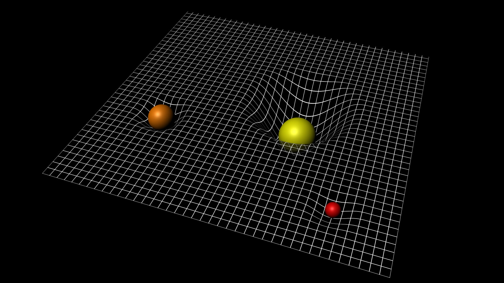

# TROU NOIR

Une simulation du cycle de vie de plusieurs étoiles sur des milliard d'années.

# INTRODUCTION

Dans le cadre de l'ARE DYNAMIC, nous nous sommes conduits à mener un projet de modélisation sur un sujet que nous avons choisi. Ce dernier se porte sur la formation d'une galaxie constituée des plusieures étoiles en débutant la modélisation. On va aussi étudier la formation des trous noirs dans différents environnements.

# THEME

Notre thème, c'est la création et l'évolution d'une galaxie et aussi le cycle de vie des étoiles.

# PROBLEMATIQUE

Après notres recherche, nous nous sommes demandés la question suivante: Est-ce qu'on va toujours avoir un trou noir géant dans une galaxie?

# HYPOTHESE 

Notre hypothèse c'est qu'on ne va pas avoir un trou noir dans chaque galaxie car on doit avoir plusieurs parametres specifiques pour la création d'un trou noir.

# QU'EST-CE QU'UN TROU NOIR?

Un trou noir est une région de l'espace dont le champ gravitationnel est si intense qu'il empêche toute forme de matière ou de rayonnement de s'en échapper. Un trou noir est créé après la mort d'une étoile très massive. Le noyau de l'étoile s'effondre sur lui-même, ce qui entraine l'expulsion des couches externes de l'étoile en une gigantesque explosion : une supernova. Tout le reste de la matière se concentre en un petit point appelé singularité. La gravité d'un trou noir est si forte qu'elle emprisonne tout – même la lumière.

Spacetime_curvature_pillars.jpg

# FORMATION DES ETOILES

-Au départ, on crée des étoiles avec des differentes caractéristiques.

-Dépendant du rayon et de la masse de l'étoile elle se transforme soit en red giant soit en red super giant.

-Avec le temps, les red giants vont mourir avec une explosion et devenir naine blanche.

-Les red supergiants vont avoir une explosion supernovae et devenir soit une étoile neutron soit un trou noir.

# ASPECTS TECHNIQUES
Notre modélisation se base sur 6 paramètres:

-Le volume des étoiles

-La masse des étoiles

-Le nombre des étoiles

-La masse volumique des étoiles

-La durée de vie des étoiles

-Le taux d'apparition des étoiles

# LES REGLES DANS NOTRE MODELISATION

-Pour la formation d'un trou noir, sa masse doit être au moins trois fois plus grande que celle du soleil et avoir un volume proportionnel. Ou bien, on peut utiliser la formule de Schwarzschild radius donné au-dessous.

-On sait que les trous noirs perdent leur volume avec le temps selon la theoreme "Hawking Radiation". On sait aussi que les trous noirs ont une force gravitationelle très forte. On a utilisé ces deux faits dans notre modèle et on a ajouté une autre fonction qui permet l'utilisateur de créer un champs gravitionnel fort quand il clique pour rendre la simulation plus amusante.

   <HTML>
   <BODY>
                              
   </BODY>
   </HTML>
  

# PLUSIEUReS EXPERIENCES

On a choisi les parametres suivants:
- Nobre d'étoiles créées au début: 12
- Taux d'apparition: 0.024
- Volume min: 13  Volume max: 69
- Durée de vie: 8 secondes
- Volume nécessaire pour devenir trou noir: 55

-Après avoir fini notre modèle, on a joué avec les paramètres pour préciser les variations possibles.

On a comparé tous nos expériences par rapport aux paramètres précedents:
- Quand on commence avec plus d'étoiles (jusqu'a 20), la probabilité qu'un trou noir assez grande se forme augmente.
- Quand on augmente le nombre d'étoiles créées chaque seconde (0.03), on attendais avoir une probabailité de trou noir plus grande mais on a vu le contraire. On a eu moins de trous noirs.
- Quand on a augmenté le volume necessaire pour devenir trou noir (62), on a eu moins de trous noirs et on a observé des essais avec aucune formation de trou noir.
- Quand on a changé la durée de vie des étoiles simples, on a eu des resultats qu'on n'attendais pas. On avait l'hypothese que si les étoiles vivaient plus longue, le trou noir aurait plus d'objets célestes à "manger" et donc on aurait davantage des trous noirs mais les résultats étaient le contraire. On a eu moins de trous noirs quand on a augmenté la durée de vie (10 secondes). On en déduit que la formatition prend plus de temps qu'avant cependant elles s'agrandissent plus rapidement. 
- Contrairement à la derniere expérience, quand on a diminué la durée de vie (5 secondes), on n'a pas eu autant de dèfférence par rapport à la premiere expérience.

  
  

# MEMBRES DU GROUPE

Can GENIS cangenis02@gmail.com                       
Ali Can CEBI alicancebi9@gmail.com                     
Yassine BAMHAOUD ybamhaoud94@gmail.com

